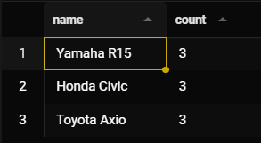

# Vehicle Rental System

## Query 1 - Retrieve booking information along with Customer name and Vehicle name

```cmd
select b.booking_id, u.name as customer_name, v.name as vehicle_name, b.start_date, b.end_date, b.status from bookings as b
  inner join users as u using(user_id)
  inner join vehicles as v using(vehicle_id);
```

**Output**


**Explanation**

This query retrieves complete booking details by joining three tables:

- **bookings table (b)**: Contains booking records with booking_id, user_id, vehicle_id, start_date, end_date, and status
- **users table (u)**: Joined using user_id to get the customer's name
- **vehicles table (v)**: Joined using vehicle_id to get the vehicle's name

The **INNER JOIN** ensures only bookings with matching users and vehicles are returned. The query uses column aliasing (`AS`) to rename columns for better readability in the output (e.g., `customer_name`, `vehicle_name`).

## Query 2 - Find all vehicles that have never been booked

```cmd
select * from vehicles as v where not exists(select vehicle_id from bookings as b where b.vehicle_id = v.vehicle_id);
```

**Output**


**Explanation**

This query identifies vehicles with zero bookings using the **NOT EXISTS** operator:

- The subquery checks if a vehicle_id exists in the bookings table
- **NOT EXISTS** returns TRUE only when the subquery returns no rows (no bookings found)
- This efficiently filters vehicles that have never been booked
- Useful for finding unused vehicles in the fleet that may need maintenance or promotional offers

## Query 3 - Retrieve all available vehicles of a specific type (e.g. cars)

```cmd
select * from vehicles where status = 'available' and type = 'car';
```

**Output**


**Explanation**

- **status = 'available'**: Selects only vehicles with an available status
- **AND type = 'car'**: Additionally filters for vehicles of type 'car'
- Both conditions must be TRUE (AND operator) for a vehicle to be included in the results
- Useful for displaying available vehicles to customers searching by vehicle type

## Query 4 - Find the total number of bookings for each vehicle and display only those vehicles that have more than 2 bookings

```cmd
select v.name, count(*) from bookings as b inner join vehicles as v using(vehicle_id) group by v.name having count(*)>2;
```

**Output**



**Explanation**

This query uses **aggregation and filtering** to find popular vehicles:

- **INNER JOIN**: Combines bookings with vehicle names
- **GROUP BY v.name**: Groups bookings by vehicle name, creating a single row per vehicle
- **COUNT(\*)**: Counts the total number of bookings for each vehicle
- **HAVING count(\*) > 2**: Filters groups to show only vehicles with MORE THAN 2 bookings
- The HAVING clause filters on aggregated data (unlike WHERE which filters before grouping)
- Useful for identifying the most frequently booked vehicles and customer preferences
