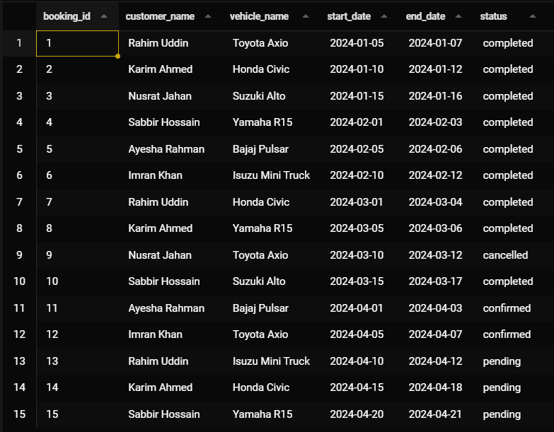

# Vehicle Rental System

## Query 1

```cmd
select b.booking_id, u.name as customer_name, v.name as vehicle_name, b.start_date, b.end_date, b.status from bookings as b
  inner join users as u using(user_id)
  inner join vehicles as v using(vehicle_id);
```



## Query 2

```cmd
select * from vehicles as v where not exists(select vehicle_id from bookings as b where b.vehicle_id = v.vehicle_id);
```


## Query 3

```cmd
select * from vehicles where status = 'available' and type = 'car';
```


## Query 4

```cmd
select v.name, count(*) from bookings as b inner join vehicles as v using(vehicle_id) group by v.name having count(*)>2;
```


